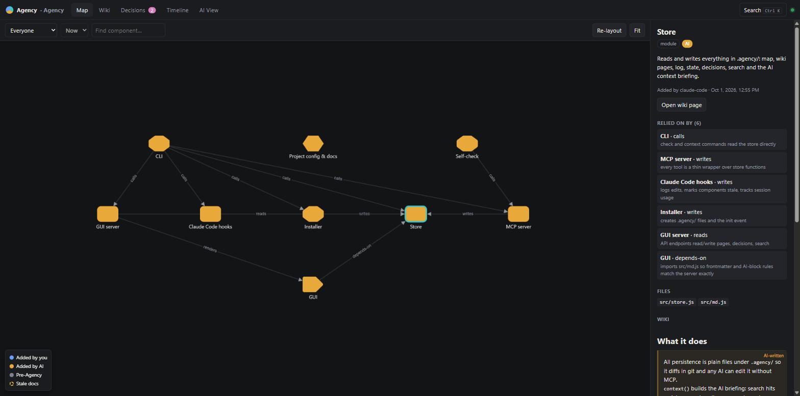
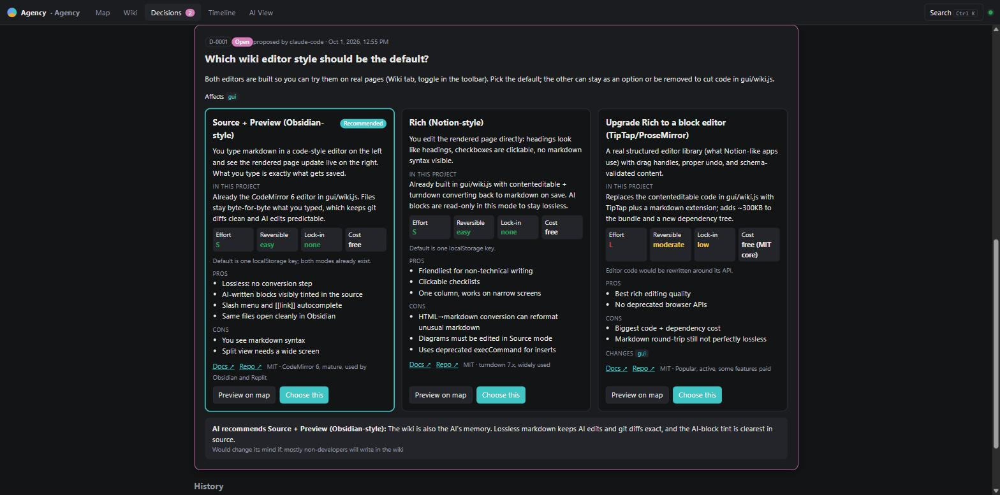
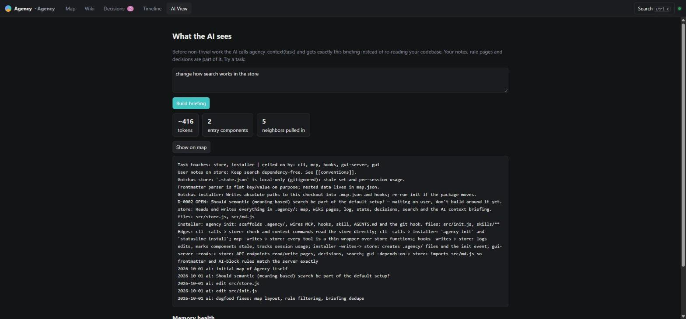
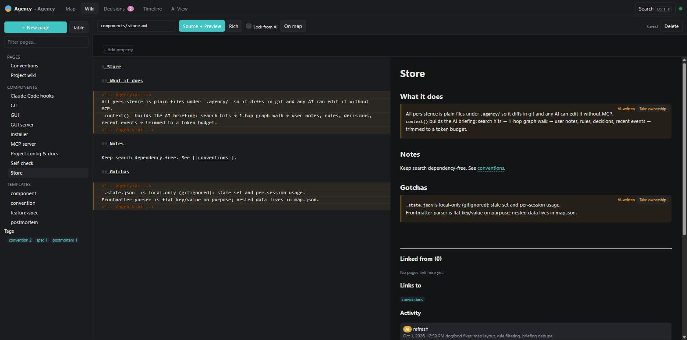
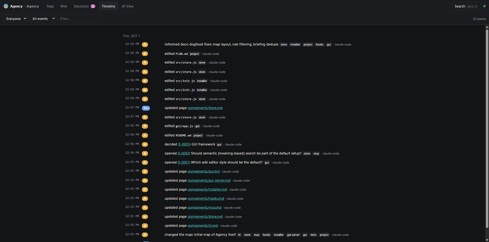
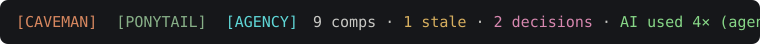

<p align="center">
  
</p>

<h1 align="center">Agency</h1>

<p align="center">
  <em>Your AI writes the code. You keep the plot.</em>
</p>

<p align="center">
  
  
  
  
  
</p>

<p align="center">
  <strong>A live map of your project &middot; a wiki that doubles as AI memory &middot; real decisions instead of one-line options &middot; a record of who added what</strong><br>
  <sub>Plain files in your repo. A local GUI on 127.0.0.1. Nothing leaves your machine.</sub>
</p>

---

<p align="center">
  
</p>

AI agents build fast. After a week of "sure, I'll add that", you have a codebase you didn't design and can't explain. What depends on the auth module? Why is there a Redis client? Did you choose that, or did the AI?

Agency gives you that understanding back. Run one command in your project and you get:

- **A map** of the main components and how they connect, colored by who added them: **you**, **the AI**, or **already there before Agency**.
- **A wiki** page for every component. Your notes there become the AI's long-term memory.
- **Decisions you can actually make.** When the AI hits a fork, it opens a decision with every option explained, linked and previewed on the map.
- **A timeline** of every edit and who made it.
- **A badge** in Claude Code's status bar, so you can see the AI is actually using all of this.

## Before / after

You ask for file uploads. The AI says:

> I can use S3, local disk, or a database blob. Which do you prefer?

With Agency, you get a decision card instead:

<p align="center">
  
</p>

Every option has to say what it is in plain language, how it fits **this** codebase, effort, how reversible it is, lock-in, cost, pros, cons, and links to docs, repo and license. The MCP server rejects a proposal that leaves any of these out. "Preview on map" highlights what each option would add or change. You pick, and from then on the map shows that the component exists **because you chose it**.

## Memory that's better than context

Context is whatever files the AI happens to open this session, and it's gone next session. Agency is memory the AI can query and you can edit.

<p align="center">
  
</p>

Before non-trivial work, the AI calls `agency_context("your task")` and gets a briefing of about 400 tokens:

1. The components the task touches.
2. One hop out on the map: what they rely on, and what relies on them (the blast radius).
3. **Your notes** on those components. These are never trimmed.
4. Every page you tagged `convention` or `rule`.
5. Related decisions, including **rejected** options, so the AI stops re-suggesting them.
6. Recent changes.

The **AI View** tab shows you exactly what the AI receives.

## A wiki you'll actually write in

<p align="center">
  
</p>

A lightweight Notion/Obsidian:

- Two editor modes: **Source + Preview** (Obsidian-style) and **Rich** (Notion-style).
- `[[wikilinks]]` with autocomplete, plus backlinks.
- `![[component]]` and `![[D-0001]]` embeds that render live cards.
- A `/` slash menu, callouts, checklists, tables and Mermaid diagrams.
- Tags, page properties, a table view across pages, templates, and `Ctrl+K` search.

**Ownership is visible.** Text the AI wrote sits in tinted blocks. Everything else is yours: the AI reads it but won't rewrite it unless you ask. "Take ownership" turns an AI block into your text. A page with `locked: true` is read-only to the AI.

The folder is a plain Obsidian vault, so you can open `.agency/wiki` in Obsidian if you prefer it.

## Who did what

<p align="center">
  
</p>

Hooks record every AI edit as it happens. A git `post-commit` hook catches everything else: your own edits, shell `sed`, other tools. Anything Agency can't attribute for certain is labelled *inferred*. Components that existed before install are honestly marked **Pre-Agency**.

## Stays current without burning tokens

The bookkeeping is deterministic code, not the model:

| Step | Who | Token cost |
|---|---|--:|
| Log an edit, map the file to its component, mark it stale | `PostToolUse` hook | **0** |
| End of turn: "these components are stale" (once per turn, never loops) | `Stop` hook | ~60 |
| Update docs: component ids only if nothing user-visible changed, else just the changed lines | AI, one `agency_refresh` call | small |
| Start of session: compact map (`api→auth,db \| …`), rule pages, open decisions | `SessionStart` hook | ~10 per component |
| Attribute commits, catch edits no hook saw | git `post-commit` | **0** |

The MCP server exposes 10 tools on purpose, because every tool definition costs context on every request.

<p align="center">
  
</p>

The status bar badge shows the component count, stale docs, open decisions, and how often the AI used Agency in the current session. It reads `idle` when the AI hasn't touched Agency yet.

## Install

Requirements: **Node.js 20+** and **git** (git is optional but recommended: it powers attribution and map history). For the AI side, **Claude Code** gets the full experience; any MCP client works for the tools.

### 1. Get the CLI

No install needed, `npx` fetches it:

```bash
npx -y agency-dev            # prints help
```

Or from source, to hack on it:

```bash
git clone https://github.com/ZakkeryBock/agency.git
cd agency
npm install        # also builds the GUI
npm link           # puts `agency` on your PATH
```

Check it works:

```bash
agency            # prints help
npm test          # end-to-end self-check: temp repo, hooks, real MCP round trip
```

### Claude Code plugin (easiest)

```
/plugin marketplace add ZakkeryBock/agency
/plugin install agency@agency
```

The plugin starts the MCP server, hooks and skill for you in every project, nothing to approve per project. In a project, run `npx -y agency-dev init --plugin` once to create `.agency/`, then ask Claude to map it. Skip step 2's plain `init`; it is for non-plugin setups.

### 2. Add it to a project

```bash
cd ~/code/your-project
npx -y agency-dev init
```

`init` is idempotent and creates or merges:

| File | What |
|---|---|
| `.agency/` | map, wiki (with starter pages and templates), decisions, log |
| `.mcp.json` | registers the `agency` MCP server for Claude Code (`npx`, so no machine-specific paths) |
| `.claude/settings.json` | `SessionStart`, `PostToolUse`, `Stop` hooks (merged, never duplicated) |
| `.claude/skills/agency/SKILL.md` | the skill: when to fetch context, how to propose decisions, how to refresh cheaply |
| `AGENTS.md` | the same instructions for Cursor, Codex and other agents (appended between markers) |
| `.git/hooks/post-commit` | commit attribution (appended, existing hooks kept) |

### 3. Claude Code

1. Restart Claude Code in the project and **approve the `agency` MCP server** when asked.
2. Say: **`map this project with agency`**. The AI splits the repo into 5–20 named components, writes their wiki pages, and every source file ends up on the map.
3. Open the GUI:

   ```bash
   agency serve          # opens http://127.0.0.1:4141/?t=<token>
   ```

4. When the AI hits a fork, the decision pops up **right in the terminal** as a pick-one form, and the same decision waits in the GUI Decisions tab. Answer in either place; the other updates and the AI continues.

5. Add the status bar badge:

   ```bash
   agency statusline-install
   ```

   If you have no statusline, this sets one. If you already have one (for example caveman or ponytail), it prints the one command to add. In a combined PowerShell statusline script, that looks like:

   ```powershell
   $agency = ($stdin | & node "C:/path/to/agency/bin/agency.js" statusline) 2>$null
   if ($agency) { $parts = @($parts) + ($agency | Out-String).Trim() }
   ```

   In a bash statusline: `echo "$input" | agency statusline`.

### 4. Other agents (Cursor, Codex, any MCP client)

`AGENTS.md` already carries the instructions. Point your client at the MCP server and run it from the project root.

**Cursor**: `.cursor/mcp.json`

```json
{ "mcpServers": { "agency": { "command": "agency", "args": ["mcp"], "env": { "AGENCY_AGENT": "cursor" } } } }
```

**Codex**: `~/.codex/config.toml`

```toml
[mcp_servers.agency]
command = "agency"
args = ["mcp"]
env = { AGENCY_AGENT = "codex" }
```

Clients without edit hooks pass the files they changed to `agency_refresh`, so the map still updates. Only Claude Code is tested end to end right now; reports for other clients are welcome.

### 5. Optional: semantic search

Text search and graph walking are always on. To also search by meaning, fully locally:

```bash
# install Ollama from https://ollama.com, then
ollama pull nomic-embed-text
```

`Ctrl+K` then shows a **Semantic** toggle, and the AI can call `agency_search(mode: "semantic")`. Vectors are cached in `.agency/.cache/`.

### Uninstall from a project

Delete `.agency/` and remove the `agency` entries from `.mcp.json`, `.claude/settings.json`, `AGENTS.md` (between the `<!-- agency -->` markers) and `.git/hooks/post-commit`.

## Commands

| Command | Does |
|---|---|
| `agency init` | set up the current project (see above) |
| `agency serve [--port N] [--no-open]` | GUI on 127.0.0.1, token-protected, live-updating |
| `agency check` | unmapped files, files in two components, dead globs, stale docs. Exits 1 on gaps, so it works in CI |
| `agency context "<task>"` | print the briefing an AI would get |
| `agency statusline-install` | add the `[AGENCY]` badge to Claude Code |
| `agency mcp` · `agency hook <name>` · `agency statusline` | called by your AI client, not by you |

## MCP tools

| Tool | For |
|---|---|
| `agency_context` | **call first**: focused briefing for a task |
| `agency_search` | text or semantic search over pages, components, decisions |
| `agency_get` | whole map plus coverage, or one component with deps, dependents and page |
| `agency_update_map` | batch upsert or remove components, link or unlink edges (each edge needs a `why`) |
| `agency_read_page` / `agency_write_page` | wiki read; write only touches AI blocks unless the user approved |
| `agency_refresh` | keep docs current after edits with minimal deltas |
| `agency_propose_decision` | open a fork; the schema forces fully explained options |
| `agency_get_decision` | status, or record the user's pick made in chat |
| `agency_record_decision` | log a minor choice the AI made itself |

## What's in `.agency/`

```
.agency/
  map.json             components (files as globs, origin: who/when/which decision) + edges (kind + why)
  wiki/                Obsidian-compatible vault
    components/<id>.md one page per component
    _templates/        component, convention, feature spec, postmortem
  decisions/D-*.json   question, options, recommendation, who chose, note
  log.jsonl            append-only events: actor (user | ai), agent, files, components, reason
  .state.json          local only, gitignored: stale set, per-session usage
```

Commit it. Then the map has history: pick a past commit in the Map toolbar to see what was added, changed or removed since.

## Privacy and security

- Everything runs locally. The GUI binds to `127.0.0.1` only, needs a random per-run token on every API call, and rejects foreign `Host` headers (DNS-rebinding guard).
- Rendered markdown is sanitized with DOMPurify, and Mermaid runs in strict mode. Treat AI-written pages as untrusted content, because they are.
- Semantic search talks only to your local Ollama. There's no telemetry.

## Status

Early alpha, built in the open. Agency maps itself: clone this repo and run `agency serve` inside it to explore a real map, wiki and decision log.

- [x] Map, wiki (two editor modes), decisions, timeline, AI View
- [x] MCP server, Claude Code hooks, skill, statusline badge, `AGENTS.md`
- [x] Git attribution, map history and diff, optional local semantic search
- [ ] Verify the AI's edges against real imports (tree-sitter) for JS/TS/Python
- [ ] Tested configs for Cursor and Codex
- [x] npm package (`npx -y agency-dev`), decisions answerable in the terminal or GUI
- [x] Claude Code plugin (`/plugin marketplace add ZakkeryBock/agency`)

The full design is in [PLAN.md](PLAN.md).

## Contributing

```bash
npm install
npm run build     # bundle gui/app.js → gui/dist/app.js
npm test          # selfcheck: init, hooks, MCP round trip, attribution, briefing
```

The codebase is small on purpose: plain ESM JavaScript, `node:http`, no UI framework. If a change adds a dependency, say why in the PR. Better yet, open a decision in Agency.

## License

[MIT](LICENSE)
